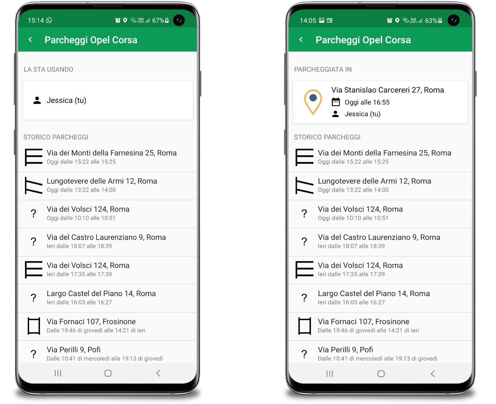

GeneroCity is a smart parking application for both Android and iOS develiped by the Gamification Lab of the Università degli Studi di Roma “La Sapienza” Computer Science department.

The goal of the app is to facilitate the excnahge of parks inside an urban area counting on the generosity of it's users.

The parking history, which I developed, allows you to view all parking sessions up to that point in chronological order and consult a series of important details related to each session. This includes the start and end time, the type of parking, its location, who performed it, and whether it was obtained and/or transferred through an exchange. It therefore also provides a record of the GeneroCoins earned or spent for each exchange.
Furthermore, the history can be viewed by all members of a car's family, allowing them to track the parking sessions made by other members.

  

